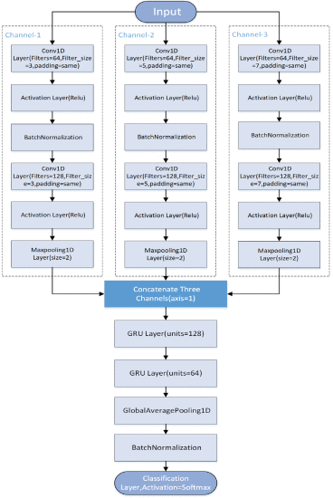
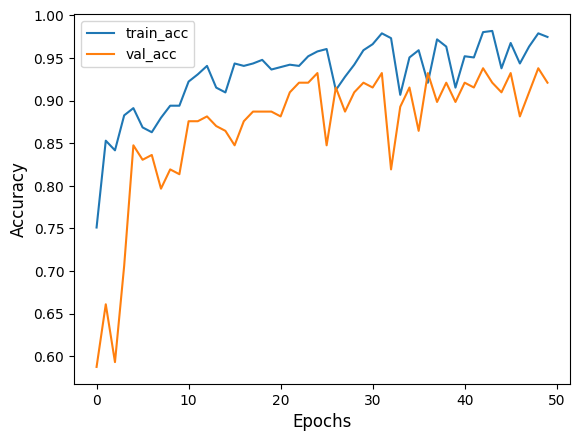
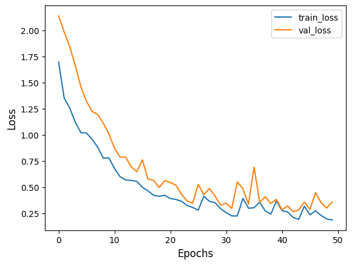

# User Authentication Using Motion Data

This repository focuses on user authentication using motion and touch gesture data from the **HMOG dataset**. By leveraging machine learning techniques, the project aims to identify users based on unique patterns in their motion data. 

The project includes Python utilities for data preprocessing and manipulation, as well as a Jupyter Notebook for data splitting and model training.

---

## Table of Contents

1. [Overview](#overview)
2. [Dataset](#dataset)
3. [Features](#features)
   - [Python Utilities](#python-utilities)
   - [Model Training Notebook](#model-training-notebook)
4. [Results](#results)
5. [Visualizations](#visualizations)

---

## Overview

Motion and touch data are highly individualistic, making them effective for user authentication. This project uses the **HMOG dataset** (Hand Movement, Orientation, and Grasp) to create a pipeline for extracting, transforming, and analyzing this data. The ultimate goal is to build a machine learning model capable of accurately authenticating users based on motion data.

---

## Dataset

The **HMOG dataset** contains data collected from mobile device sensors, including:
- **Motion Data**: Accelerometer, gyroscope, and magnetometer readings.
- **Touch Gesture Data**: Touchscreen interaction logs, such as swipe gestures.

### Key Details:
- The dataset includes data from multiple users, structured across different sessions.
- For this project, the model was trained on **3 users with 13 sessions each**, using a combination of motion and touch gesture data.
- Preprocessing steps were implemented to standardize and balance the data.
- Link to the dataset: [HMOG Dataset](https://hmog-dataset.github.io/hmog/)

---

## Features

### Python Utilities (Data Loading)

This repository includes a Python script with five key functions for processing and preparing the HMOG dataset:

1. **`overSampling()`**:
   - Addresses the imbalance between touch gesture logs (small in size) and motion sensor logs (larger in size).
   - Uses oversampling to replicate touch gesture samples and balance the dataset.

2. **`ETLHelper()`**:
   - Acts as a helper for the ETL process (Extract, Transform, and Load).
   - Facilitates the preprocessing pipeline for motion and gesture data.

3. **`ETL()`**:
   - Implements the complete ETL process:
     - **Extract**: Reads raw motion and gesture data.
     - **Transform**: Cleans, standardizes, and formats the data.
     - **Load**: Prepares data for machine learning tasks.

4. **`dataGenerator()`**:
   - Generates batches of data for machine learning models.
   - Handles large datasets efficiently by creating data slices for training and validation.

5. **`slice()`**:
   - Splits motion data into overlapping slices for analysis.
   - Enables feature extraction from smaller, overlapping windows of motion logs.

### Model Training Notebook

The repository also includes a **Jupyter Notebook** that:
- Splits the processed data into training, validation, and testing sets.
- Trains **3-channel models** for user authentication.
- Evaluates models based on **accuracy** and **loss**.

---

## Results

The model achieved **92% test accuracy** when trained on data from three users with 13 sessions each. This demonstrates the feasibility of using motion and touch gesture data for reliable user authentication.

---

## Visualizations

### Model Architecture
Below is the architecture of the model used for user authentication:

### Training Accuracy and Loss Graphs
The training and validation performance of the model is visualized below:

- **Accuracy over Epochs**:
  

- **Loss over Epochs**:
  

---

